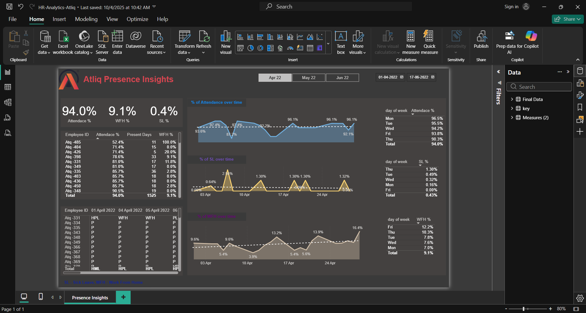

# HR-Analytics-Dashboard-
# 📊 HR Analytics Dashboard | AtliQ Presence Insights

## 📝 Project Overview
This project involves the creation of a comprehensive **HR Analytics Dashboard** using Microsoft Power BI. The dashboard, titled "AtliQ Presence Insights," provides a detailed overview of employee attendance, work-from-home (WFH) trends, and sick leave (SL) patterns over a three-month period (April, May, June 2022).

The goal of this dashboard is to assist HR managers in tracking workforce presence, identifying trends in leave patterns, and making data-driven decisions regarding hybrid work policies.

## 📄 Full Report
**[📥 Download the Full PDF Report here](HR-Analytics-Atliq.pdf)**
*(Click to view the complete report on mobile or desktop)*

---

## 📸 Dashboard Visuals

### 1. Home Dashboard (Overview)

*A detailed overview of employee attendance, WFH trends, and sick leave patterns.*

### 2. Monthly Trends Analysis

*Line charts showing daily fluctuations in Attendance, WFH, and SL percentages.*

### 3. Employee Detail Drill-Down

*Granular table view allowing deeper analysis of individual employee performance.*

---

## 📈 Key Performance Indicators (KPIs)
The dashboard focuses on three primary metrics to evaluate workforce productivity:
* **Attendance %:** The percentage of working days an employee was present at work.
* **WFH %:** The percentage of working days an employee worked remotely.
* **SL % (Sick Leave):** The percentage of working days an employee took sick leave.

## 💡 Key Insights & Findings
Based on the visual analysis of the dashboard data:
* **Overall Stability:** The cumulative attendance across the dataset stands at **91.7%**, indicating a generally stable workforce.
* **Month-over-Month Variance:**
    * **April 2022:** Highest attendance (94.0%) with minimal sick leave (0.4%).
    * **May 2022:** A noticeable dip in attendance (89.7%), accompanied by a spike in Sick Leave (1.7%) and increased WFH (11.2%).
* **Weekly Patterns:** Mondays consistently show strong attendance (approx. 93%–96%), while Fridays show higher WFH percentages.

## 🛠 Tech Stack
* **Tool:** Microsoft Power BI
* **Data Cleaning:** Power Query Editor
* **Data Analysis:** DAX (Data Analysis Expressions)
* **Data Source:** Excel/CSV (HR Attendance Records)

## 🔄 Data Process (Workflow)
1.  **Data Extraction:** Imported daily attendance data for all employees.
2.  **Data Transformation:** Used Power Query to unpivot columns and create a "Date" dimension.
3.  **Measure Creation:** Developed DAX measures to calculate percentage aggregations.
4.  **Dashboard Design:** Designed an interactive UI using AtliQ corporate branding colors.

## 🚀 Conclusion
This dashboard successfully provides HR leadership with a "bird's-eye view" of workforce behavior. The ability to drill down from a 3-month overview to daily trends allows for proactive management of employee engagement and capacity planning.

